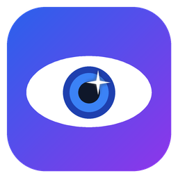

<p align="center">
  
</p>

<h1 align="center">Lighteye</h1>

<p align="center">
  Editor de fotos <b>no destructivo</b> para Linux y Windows, con revelado RAW,
  presets acumulables y herramientas de <b>IA</b> (restaurar rostros, retoque,
  quitar el fondo, borrar objetos y escalado).
</p>

<p align="center">
  Versión 1.0.0 · Python 3.13 · PySide6 (Qt 6) · NumPy + OpenCV · PyTorch
</p>

---

## Índice

1. [Qué es](#qué-es)
2. [Funciones](#funciones)
3. [Herramientas de IA](#herramientas-de-ia)
4. [Presets y LUT](#presets-y-lut)
5. [Interfaz y atajos de teclado](#interfaz-y-atajos-de-teclado)
6. [Formatos](#formatos)
7. [Dónde guarda las cosas](#dónde-guarda-las-cosas)
8. [Instalación](#instalación)
9. [Requisitos](#requisitos)
10. [Arquitectura técnica](#arquitectura-técnica)
11. [Rendimiento](#rendimiento)
12. [Estructura del proyecto](#estructura-del-proyecto)
13. [Desarrollo, pruebas y compilación](#desarrollo-pruebas-y-compilación)
14. [Licencias de los modelos](#licencias-de-los-modelos)
15. [Pendiente](#pendiente)

---

## Qué es

Lighteye nunca modifica la foto original. Cada edición es una lista de ajustes
que se guarda en un archivo junto a la foto (`foto.jpg.json`) y se recupera al
volver a abrirla. El resultado final se obtiene al **exportar**.

Toda la edición se hace en **color lineal en coma flotante (float32)**, y solo se
convierte a sRGB para mostrar o exportar: así se evitan bandas y colores raros.
La vista previa trabaja a 1600 px de lado largo y la exportación a resolución
completa con el mismo procesado, de modo que lo que ves es lo que se exporta.

## Funciones

### Ajustes de luz
| Ajuste | Rango | Cómo funciona |
|---|---|---|
| Exposición | −4 a +4 EV | Multiplica en lineal por 2^EV |
| Contraste | −100 a +100 | Curva en S alrededor del gris medio (18 %) |
| Altas luces / Sombras | −100 a +100 | Curva tonal sobre la luminancia; recupera hasta 2 pasos por encima del blanco (útil en RAW) |
| Blancos / Negros | −100 a +100 | Mueven los extremos de la curva |
| Curvas | RGB y por canal (R, G, B) | Editor con puntos arrastrables, interpolación monótona (sin “pasarse”) |

### Color
| Ajuste | Notas |
|---|---|
| Temperatura y tinte | Ganancias por canal que conservan la luminancia |
| Intensidad (vibrance) | Satura más los colores apagados y **protege los tonos de piel** |
| Saturación | −100 (blanco y negro) a +100 |
| HSL por color | Tono, saturación y luminancia para 8 colores (rojo, naranja, amarillo, verde, aguamarina, azul, morado, magenta) |
| LUT | Archivos `.cube` 3D (trilineal) y 1D, con intensidad 0–100 % |

### Detalle
| Ajuste | Notas |
|---|---|
| Nitidez | Máscara de enfoque sobre la luminancia |
| Reducción de ruido | De luminancia y de color, por separado; no “derrama” los colores en los bordes |
| Claridad | Contraste local en los medios tonos, con control de halos |
| Neblina | Quita o añade neblina (Dark Channel Prior simplificado) |

### Efectos
Viñeta (cantidad, tamaño, suavidad) · Grano (cantidad, tamaño; el mismo patrón en
vista previa y exportación) · Blanco y negro con mezcla de canales · Virado (tono
dividido: color para sombras y luces, con equilibrio).

### Geometría
Recortar con proporciones fijas (libre, original, 1:1, 4:5, 3:2, 16:9, en
horizontal o vertical) · Enderezar ±45° con recorte automático sin esquinas
vacías · Girar 90° · Voltear horizontal y vertical. El recorte se guarda
normalizado, así sirve igual para la vista previa y para la foto completa.

### Flujo de trabajo
- **Historial** de deshacer / rehacer (un arrastre de slider cuenta como un solo paso).
- **Antes / Después / Comparar**: botones bajo la foto; en *Comparar*, una línea divisoria arrastrable.
- **Histograma** RGB + luminancia con aviso de recorte (zonas quemadas en rojo, empastadas en azul sobre la foto).
- **Pestaña «Aplicados»**: solo los ajustes de la foto, agrupados por el preset del que vienen; cada valor se puede editar o quitar.
- **Navegador de carpeta**: tira de miniaturas (con todas las ediciones, incluida la IA ya calculada), insignia en las fotos editadas, foto anterior/siguiente.
- **Copiar y pegar ajustes** entre fotos (también desde el clic derecho), sin copiar recorte ni borrados.
- **Acciones sobre varias fotos**: pegar ajustes, añadir un preset, restablecer o exportar por lotes.
- **Exportar**: JPG (calidad), PNG 8/16 bits, TIFF 16 bits, límite de lado largo, escalado con IA ×2/×4, conserva el EXIF (JPG y PNG) y nunca sobrescribe el original.

## Herramientas de IA

Funcionan en cualquier PC: usan la **GPU NVIDIA** si tiene memoria libre y, si no,
el **procesador**. Cada resultado se calcula **una sola vez por foto** y se guarda
en caché; después los sliders, el recorte y los giros son instantáneos. Mientras
calcula, un indicador en la foto muestra la tarea, los segundos y el dispositivo.

| Herramienta | Dónde | Modelo | Qué hace |
|---|---|---|---|
| Restaurar rostros | «Rostros (IA)» | GFPGAN 1.4 / CodeFormer | Detecta caras (YuNet), las alinea, las restaura y las pega con borde suave. CodeFormer tiene un slider de fidelidad a la identidad |
| Retoque | «Retoque (IA)» | BiSeNet (face parsing) | Suavizar piel (conserva poros), iluminar ojos, color de labios, brillo del cabello; cada uno solo en su zona |
| Quitar el fondo | «Fondo (IA)» | BiRefNet | Fondo transparente o de color, con ajuste de borde. PNG/TIFF guardan la transparencia |
| Borrar objetos | Tecla **B** (pincel) | LaMa | Se pinta lo que se quiere quitar y se rellena con el entorno. Los trazos se guardan normalizados y se deshacen con Ctrl+Z |
| Escalar ×2 / ×4 | Diálogo de exportación | Real-ESRGAN | Aumenta la resolución con detalle, por mosaicos |

Si faltan PyTorch o los modelos, esas secciones aparecen desactivadas y el resto
de Lighteye funciona igual.

## Presets y LUT

- **21 presets incluidos**, en dos pestañas:
  - *Ajustes* (10): Retrato (Natural, Piel suave, Ojos y plata), Estudio (Clave alta, Clave baja), B/N Retrato clásico, Exterior Dorado, Editorial Frío, Película Mate, Cine Teal & orange.
  - *IA* (10): Retrato pulido, Belleza suave, Ojos que brillan, Cabello plateado, Restaurar natural, Restaurar fiel (CodeFormer), Fondo blanco (carnet), Recorte transparente, Estudio gris, Editorial.
  - *Ninguno (original)* en ambas pestañas.
- **Clic** en un preset = **vista previa** (no se aplica; Esc para salir). **Botón «+»** = añadirlo.
- Los presets **se acumulan**: si dos tocan el mismo ajuste, gana el último. Al quitar uno, sus ajustes vuelven a como estaban antes (lo hecho a mano se respeta).
- Los presets propios se guardan con «Guardar actual…» y van a la pestaña que corresponda (los que usan IA, a *IA*).
- **5 LUT incluidos**: Cine (teal & orange), Cálido, Película desvaída, Blanco y negro contrastado y Noche azul; además se puede cargar cualquier `.cube`.

## Interfaz y atajos de teclado

Barra superior de iconos (con un menú ☰ que lista todo), paneles de *Presets*
(izquierda), *Ajustes / Aplicados* con histograma (derecha) y *Carpeta* (abajo).

| Acción | Atajo |
|---|---|
| Abrir foto / carpeta | Ctrl+O / Ctrl+Shift+O |
| Foto anterior / siguiente | Ctrl+← / Ctrl+→ |
| Exportar / exportar seleccionadas | Ctrl+E / Ctrl+Shift+E |
| Deshacer / rehacer | Ctrl+Z / Ctrl+Shift+Z (o Ctrl+Y) |
| Copiar / pegar ajustes | Ctrl+Shift+C / Ctrl+Shift+V |
| Restablecer todos los ajustes | Ctrl+R |
| Recortar y enderezar | C (Intro aplica, Esc cancela) |
| Borrar objetos (pincel) | B (Intro o Esc para terminar) |
| Antes / después | \ |
| Ajustar a la ventana / 100 % | Ctrl+0 / Ctrl+1 |
| Quitar la vista previa de un preset | Esc |
| Restablecer un slider | Doble clic sobre él |

## Formatos

- **Abrir**: JPG, PNG, TIFF (8/16 bits y coma flotante), WebP, BMP y RAW
  (CR2, CR3, NEF, ARW, DNG, RAF, ORF, RW2, PEF, SRW y otros, vía LibRaw).
  Aplica la orientación EXIF; las imágenes con transparencia se abren sobre blanco.
- **Exportar**: JPG, PNG 8/16 bits, TIFF 16 bits (LZW). Canal alfa en PNG/TIFF al quitar el fondo.

## Dónde guarda las cosas

| Qué | Linux | Windows |
|---|---|---|
| Ajustes de cada foto | `foto.ext.json` junto a la foto | igual |
| Presets propios | `~/.config/lighteye/presets/` | `%APPDATA%\Lighteye\presets\` |
| Caché (miniaturas y resultados de IA) | `~/.cache/lighteye/` | `%LOCALAPPDATA%\Lighteye\cache\` |
| Modelos de IA | `models/` del proyecto o junto al ejecutable | junto a `Lighteye.exe` |

La caché se puede borrar sin perder nada: se vuelve a calcular cuando hace falta.

## Instalación

### Paquete compilado (recomendado)
En **Releases** hay paquetes para Linux y Windows en dos variantes, con los
modelos de IA incluidos, partidos en trozos de menos de 2 GB (`.7z.001`, `.7z.002`…):

- **gpu**: usa la tarjeta NVIDIA (CUDA) si hay memoria libre; si no, el procesador.
- **cpu**: solo procesador; descarga más pequeña.

Descarga todos los trozos de tu sistema y variante en la misma carpeta y abre el `.001`
con 7-Zip (Windows) o `7z x` (Linux).

- **Linux**: dentro de la carpeta, `./install.sh` lo añade al menú de aplicaciones
  (con icono y el comando `lighteye`); `./uninstall.sh` lo quita.
- **Windows**: abre `Lighteye.exe`; «Crear accesos directos.bat» lo añade al menú
  Inicio y al Escritorio.

### Desde el código (CachyOS / Arch, shell fish)
```fish
git clone https://github.com/ErickColumba/Lighteye.git
cd Lighteye
python3.13 -m venv .venv
source .venv/bin/activate.fish
pip install --index-url https://download.pytorch.org/whl/cu130 torch torchvision   # o /whl/cpu
pip install -r requirements.txt
python tools/download_models.py   # modelos de IA (~1,6 GB)
python main.py                    # o: python main.py foto.jpg
```

## Requisitos

| | Mínimo | Recomendado |
|---|---|---|
| Sistema | Linux x86-64 (glibc 2.35+) o Windows 10/11 64 bits | — |
| RAM | 8 GB | 16 GB o más (fotos de 24 MP con IA llegan a ~3 GB) |
| GPU | No hace falta (variante *cpu*) | NVIDIA con 4 GB+ de VRAM libres y driver reciente (CUDA 12.8) |
| Disco | ~3 GB (variante *cpu*) | ~6 GB (variante *gpu*) + caché |

## Arquitectura técnica

### Tecnologías
| Componente | Tecnología |
|---|---|
| Lenguaje | Python 3.13 |
| Interfaz | PySide6 (Qt 6) |
| Procesado de imagen | NumPy 2 + OpenCV (headless) |
| RAW | rawpy (LibRaw) |
| EXIF | piexif |
| IA | PyTorch + spandrel (carga de modelos), BiRefNet incluido en `app/ai/vendor` (sin `transformers`), timm, kornia |
| Empaquetado | PyInstaller + 7-Zip; compilación en GitHub Actions |

### Orden del procesado
1. **Origen**: foto en float32 lineal → geometría (giro, volteo, enderezado y recorte en una sola transformación afín) → reducción a 1600 px para la vista previa.
2. **IA sobre el origen** (en el hilo de trabajo): pegar zonas borradas (LaMa) → pegar rostros restaurados → retoque con máscaras (BiSeNet).
3. **Pipeline de ajustes** (`app/core/pipeline.py`): balance de blancos → exposición → reducción de ruido → altas luces / sombras / blancos / negros → contraste → curvas → HSL → intensidad → saturación → LUT → claridad → neblina → blanco y negro → virado → viñeta → nitidez → grano.
4. **Composición final**: fondo nuevo (BiRefNet) y conversión a sRGB.

Los resultados de IA se calculan sobre la foto original y se guardan con su
transformación; se pegan en cualquier tamaño, recorte o giro mediante
`geometry_matrix`, sin recalcular.

### Vista previa fluida
- El procesado va en un hilo aparte; solo hay un cálculo en marcha y se descartan los intermedios.
- **Caché del pipeline**: al mover un slider se reutiliza el resultado de los pasos anteriores.
- **Borrador** a media resolución mientras se arrastra; la versión completa al soltar.
- Curvas y conversiones de color con **tablas (LUT) de 16 bits**; balance de blancos y saturación como matriz 3×3.
- Ajuste del asignador de memoria (`mallopt`) que evita fallos de página en cada operación de NumPy (~3× más rápido en Linux).
- PyTorch solo se carga al usar la IA (arranque en ~0,25 s con ~120 MB de RAM).

## Rendimiento

Medido en Ryzen 7 7700X + RTX 4060 Ti 16 GB:

| Operación | Tiempo |
|---|---|
| Arrancar | ~0,25 s |
| Abrir una foto de 6 MP / 24 MP | ~0,2 s / ~0,8 s |
| Mover un slider (todo activado) | 12–50 imágenes/s según el ajuste |
| Exportar 6 MP con ajustes | 0,15–2 s |
| Exportar 24 MP con todas las herramientas de IA | ~2–3 s (con la IA en caché) |
| Quitar el fondo (primera vez) | ~1 s con GPU · ~15 s con procesador |
| Restaurar un rostro / analizar / borrar | ~1 s con GPU · 3–9 s con procesador |

## Estructura del proyecto

```
Lighteye/
├── main.py                 punto de entrada (también: --self-test)
├── app/
│   ├── core/               procesado sin interfaz: cargar, ajustes, pipeline,
│   │                       geometría, color, LUT, curvas, presets, historial,
│   │                       miniaturas, exportación
│   ├── ai/                 runtime (GPU/CPU), registro de modelos, rostros,
│   │                       retoque, fondo, borrar objetos, BiSeNet, vendor/BiRefNet
│   ├── ui/                 ventana, visor, paneles, editor de curvas, presets,
│   │                       «Aplicados», recorte, pincel, tira de carpeta, iconos
│   ├── luts/               LUT incluidos (.cube)
│   ├── presets/            presets incluidos (.json)
│   ├── resources/          icono
│   ├── paths.py            rutas por sistema
│   └── selftest.py         autocomprobación
├── models/                 modelos de IA (no están en git)
├── tests/                  232 pruebas (pytest)
├── tools/                  descargar modelos, medir rendimiento, generar LUT y presets
├── packaging/              PyInstaller, build.py, icono, instaladores Linux/Windows
├── docs/                   diseño original y plan por etapas
└── .github/workflows/      compilación Linux + Windows
```

## Desarrollo, pruebas y compilación

```fish
python -m pytest                          # 232 pruebas (las de IA se saltan si faltan los modelos)
python main.py --self-test                # comprueba pipeline, exportación y cada modelo de IA
python tools/bench_pipeline.py            # tiempo de cada ajuste
python tools/bench_pipeline.py --drag     # fluidez al arrastrar sliders
python tools/download_models.py --list    # estado y licencias de los modelos
python tools/make_example_luts.py         # regenera app/luts/
python tools/make_default_presets.py      # regenera app/presets/
```

Compilar:
```fish
python packaging/build.py --variant gpu             # dist/Lighteye/ (o --variant cpu)
python packaging/build.py --variant gpu --archive   # además el .7z en trozos < 2 GB
dist/Lighteye/Lighteye --self-test
```

En **GitHub Actions** (`.github/workflows/compilar.yml`) se compilan Linux y Windows
en las variantes *gpu* (CUDA 12.8) y *cpu*; cada paquete pasa las pruebas y
`--self-test` y se publica en *Releases*. Se lanza a mano (*Actions → Compilar
Lighteye → Run workflow*) o al subir una etiqueta `v*`.

## Licencias de los modelos

| Modelo | Uso | Licencia |
|---|---|---|
| Real-ESRGAN x2/x4 | Escalado | BSD-3-Clause |
| GFPGAN 1.4 | Restaurar rostros | Apache-2.0 |
| CodeFormer | Restaurar rostros (identidad) | S-Lab 1.0 — **solo uso no comercial** |
| BiSeNet (facexlib) | Análisis facial | MIT |
| LaMa | Borrar objetos | Apache-2.0 |
| BiRefNet | Quitar el fondo | MIT |
| YuNet (OpenCV Zoo) | Detectar rostros | MIT |

## Pendiente

- **SUPIR** (escalado con recuperación de detalle): basado en SDXL, más de 10 GB y
  12 GB+ de VRAM; se valorará como complemento opcional.
- **Ajustes locales manuales** (fase 2): pincel de ajustes, degradados lineal y
  radial, máscaras por luminancia o color.
- **Fase 3 restante**: mejora automática de un clic, selección de cielo y reemplazo de cielo.
- Primera compilación en GitHub Actions (la versión de Windows aún no se ha probado
  en un equipo Windows).
